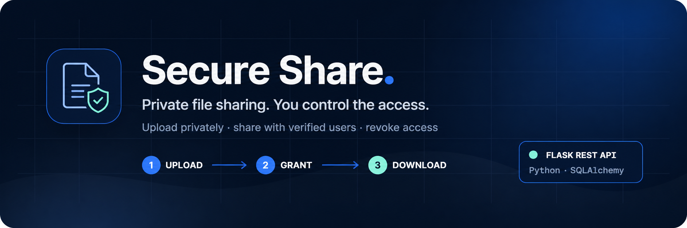
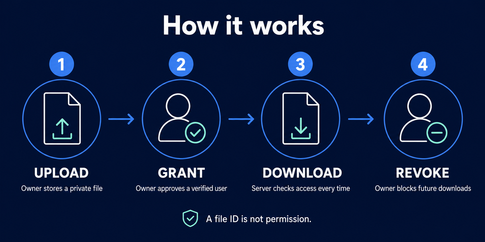
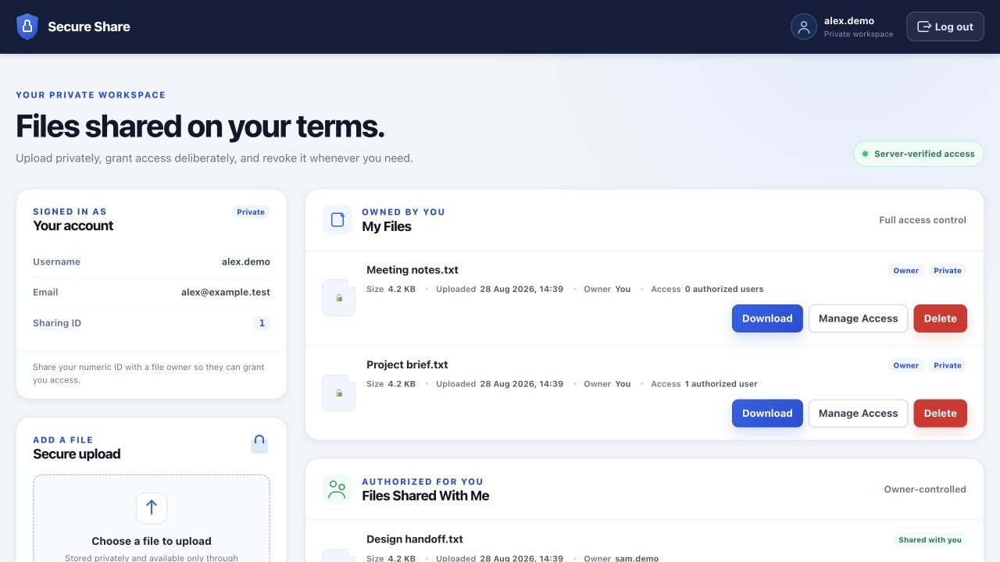

# Secure Share



<p align="center">
  <strong>Python 3.12+ · Flask REST API · SQLAlchemy · MIT License</strong>
</p>

Upload files privately, share them with verified users, and revoke access when
needed. A browser dashboard and REST API use the same server-side permissions.

<p align="center">
  <a href="#how-it-works">How it works</a> ·
  <a href="#interface">Interface</a> ·
  <a href="#quick-start">Quick start</a> ·
  <a href="docs/technical-guide.md#api-reference">API</a> ·
  <a href="docs/technical-guide.md#configuration-and-production-operations">Deployment</a>
</p>

## What you get

- **Private by default:** authenticated uploads and downloads; no public file links.
- **Owner-controlled sharing:** grant verified users access, revoke it, or delete your files.
- **Account security:** email verification, password recovery, expiring sessions, and browser CSRF protection.
- **Simple dashboard:** manage My Files, Shared With Me, uploads, and permissions.
- **API access:** opaque bearer sessions for scripts and other clients.

## How it works



Register and verify your email, then sign in. Upload a file and grant access using
the recipient's Sharing ID. Only the owner and explicitly authorized users can
download it. The owner can remove that permission at any time.

> Revocation blocks future download requests; it cannot erase copies already
> downloaded. Files are access-controlled, not end-to-end encrypted.

## Interface



*Actual application interface, captured locally with synthetic demo accounts and files.*

## Quick start

Requires Python 3.12 or newer.

```bash
git clone https://github.com/VidulaWickramasinghe/Secure_Share.git
cd Secure_Share
python3.12 -m venv .venv
source .venv/bin/activate
python -m pip install -r requirements.txt
cp .env.example .env
```

If you already have a `.env`, keep it instead of copying over it. Generate three
independent secrets with the command below and set `SECRET_KEY`,
`ACCOUNT_TOKEN_PEPPER`, and `RATE_LIMIT_KEY_SECRET` in `.env`:

```bash
python -c "import secrets; print(secrets.token_urlsafe(48))"
```

Run that generator once per secret, then initialize and start the app:

```bash
flask --app run.py init-db
flask --app run.py run
```

Open [localhost:5000](http://127.0.0.1:5000). Development verification emails are
saved as private `.eml` files in `instance/mail-outbox`; open the verification
link to finish account setup.

## Development

```bash
python -m pip install -r requirements-dev.txt
pytest
```

The stack is Flask, SQLAlchemy, SQLite for local development, PostgreSQL for
production, and vanilla JavaScript. CI covers Python 3.12–3.14 plus linting,
security, and deployment-dependency checks.

## Deployment and documentation

Production needs HTTPS, PostgreSQL, private persistent file storage, shared Redis,
SMTP, and a separate email worker. The Vercel entrypoint is configured, but full
production compatibility is **not complete**. Do not use the development server
for production.

For `FUNCTION_INVOCATION_FAILED` or a **setup required** response on Vercel,
follow the [deployment troubleshooting guide](docs/vercel-deployment.md).
It distinguishes a successful build from a working application and includes a
command that reports configuration problems together without printing secrets.

See the [technical guide](docs/technical-guide.md) for
[architecture](docs/technical-guide.md#architecture),
[API endpoints](docs/technical-guide.md#api-reference),
[configuration](docs/technical-guide.md#configuration-and-production-operations),
[migrations](docs/technical-guide.md#database-migrations), and
[remaining work](docs/technical-guide.md#delivery-status-and-future-work).

## License

[MIT](LICENSE) — Copyright (c) 2026 VIdula Wickramasinghe.
